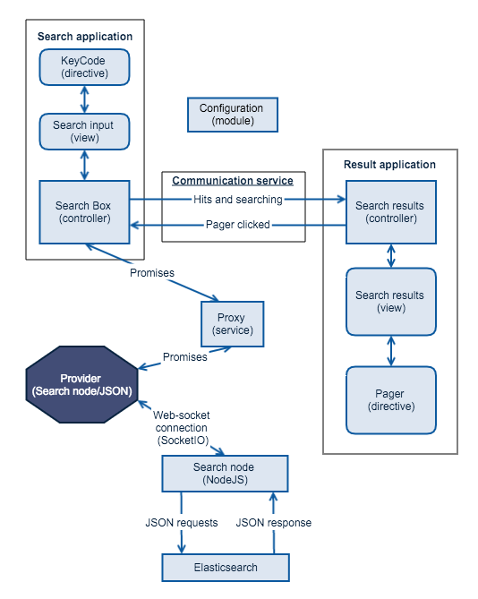

# AngularJS (front end)
The search front-end that users interact with is written in [AngularJS][angularjs] and is developed in the [search prototype][searchpt] git repository. The script files that should be used in production is the minified versions that are build using a [gulp][gulp] task and is located in the build folder.

The Angular front-end is in fact to applications that communicates with each other, namely search box and search results. It's divided into two applications to create a more flexible front end, that can be placed in different regions on a given page. This also makes it easier to integrate the search into existing CMS frameworks.

The Angular application(s) can use different providers, so it's possible to search via search node or in a JSON data file for faster prototype testing (JSON provider correctly don't support all feature sets yet). One could also create a whole new provider to send search request to third party search engines.

It's build using these parts seen from a top-down view.

* Views (templates)
    * Search box (plus filters)
    * Search results (plus pager and searching spinner)
    * Directives
        * KeyCode (capture keyboard events)
        * Pager
* Controllers
    * Search box
    * Results
* Services
    * Search proxy (sends work to configured provider)
    * Communication (handle events between the to applications)
* Providers
    * Search node
    * JSON

The figure below show how these different components interact with each other and how the date flow is between the two Angular applications. The figure also shows that the configuration is load as an Angular module and is accessible through independency injection (_CONFIG_) throughout the whole framework.



## Configuration
The whole setup is highly configurable and can easily be modified through the configuration (and it's behaviour can be changed by coping, modifying and overriding the contorllers). The configuration is loaded as an Angular module, that can be auto-generated from within a CMS framework or simply typed by hand and added to the page before the application is loaded.

The configuration is defined in JSON and is divided into three parts.

* Basic configuration
    * Id (required) - Unique id for this instanced (used in cache id's for localstorage).
    * initialQueryText (optiona) - Search that will be executed on page load.
* Templates (all required)
    * box - The template used to generate the search box and filters area.
    * result - The results listing template and also the searching spinner.
    * pager - The template used by the pager.
* Provider
    * service (required) - The provider to use.
    * All other are provide configuration options.

The example below is for the search node provider and show the different options available for that provider. The [search prototype][searchpt] repository contains example configuration for the different providers.
```javascript
angular.module('searchAppConfig', [])
  .constant('CONFIG', {
    'id' : 'Search prototype',
    'initialQueryText': '',
    'templates': {
      'box': '/js/views/search.html',
      'result': '/js/views/result.html',
      'pager': '/js/directive/pager-directive.html'
    },
    'provider': {
      'service': 'searchNodeProvider',
      'host': 'https://search.node.vm',
      'auth': '/auth.php',
      'index': 'e7df7cd2ca07f4f1ab415d457a6e1c13',
      'fields': ['title', 'body:value'],
      'pager': {
        'size': 8,
        'page': 0
      },
      'cacheExpire': 30,
      'intervals': ['created'],
      'filters': [
        {
          'field': 'field_level',
          'name': 'Level',
          'type': 'and',
          'terms': {
            "First": {
              'value': 'First'
            },
            "Second": {
              'value': 'Second'
            },
            "Third": {
              'value': 'Third'
            },
            "Fourth": {
              'value': 'Fourth'
            },
          }
        },
        {
          'field': 'field_technology',
          'name': 'Technology',
          'type': 'and',
          'terms': {
            "Angular": {
              'value': 'Angular'
            },
            "Javascript": {
              'value': 'Javascript'
            },
          }
        }
      ]
    }
  });
```

@TODO: Above is missing date examples for the search provider.

### Loading the applications.
It's important to load the different parts

```html
<!-- Load angular  -->
<script src="angular.min.js"></script>

<!-- Load the application configuration -->
<script src="config.js"></script>

<!-- Load the app -->
<script src="assets.min.js"></script>
<script src="search.min.js"></script>
```

### Application targets

```html
<div id="searchBoxApp" data-ng-strict-di data-ng-controller="boxController">
  <span data-ng-include="template">
    JavaScript have not been loaded.
  </span>
</div>
```

```html
<div id="searchResultApp" data-ng-strict-di data-ng-controller="resultController" >
  <span data-ng-include="template">
    JavaScript have not been loaded.
  </span>
</div>
```

## Development (search prototype)

### Cache + md5


### Build process

```bash
gulp build --production
```

### Vagrant
